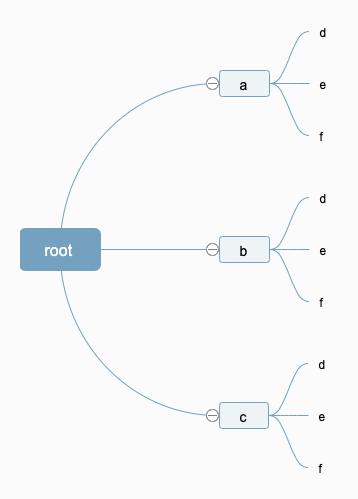

### 电话号码的字母组合

#### 题目

>  给定一个仅包含数字 `2-9` 的字符串，返回所有它能表示的字母组合。  
>
> 给出数字到字母的映射如下（与电话按键相同）。注意 1 不对应任何字母。


#### 示例：

```
输入：“23”
输出：["ad", "ae", "af", "bd", "be", "bf", "cd", "ce", "cf"].
```


#### 题解一

我们通过观察可以发现，这个问题就是求输入的集合的笛卡尔集。每次输入的结果，都是上一次输入结果和当前的输入的集合的笛卡尔集。因此，可以有以下算法

1. 没有输入的情况下最终的集合应该只包含一个空字符串[""]
2. 每输入一个字符，则将其对应的集合和上一次的结果做笛卡尔集运算
3. 直至输入结束

```javascript
/**
 * @param {string} digits
 * @return {string[]}
 */
var letterCombinations = function(digits) {
  const dict = ['', '', 'abc', 'def', 'ghi', 'jkl', 'mno', 'pqrs', 'tuv', 'wxyz']
  if(!digits.length) {
    return []
  }
  let strArr = ['']
  for (let i = 0; i < digits.length; i++) {
    const charArr = dict[digits[i]].split('')
    const currentLetters = []
    strArr.forEach(item => {
      currentLetters.push(...charArr.map(c => item + c))
    })
    strArr = currentLetters
  }
  return strArr
};
```

#### 题解二

我们可以用树的思想来考虑这个问题，每个输入的可能性，都相当于这个树的分支，最终我们深度遍历这个树，也可以得出最终的结果，以输入“23”为例：



这里假设`root`为空字符串`""`，这时候，上面的树，所有的从根节点到叶子结点的路径的集合，就是我们要的结果

##### 树的DFS写法

```javascript
// 深度遍历
const dfs = (data) => {
  for(let i = 0; i < data.length; i++) {
    console.log(data)
    if(data[i].children) {
      dfs(data[i].children)
    }
  }
}
```

##### 改造

是否有`children`，我们就需要看是否有后续的输入，而`children`很显然就是我们数字对应的字母集合了。

```javascript
/**
 * @param {string} digits
 * @return {string[]}
 */
var letterCombinations = function(digits) {
  const dict = ['', '', 'abc', 'def', 'ghi', 'jkl', 'mno', 'pqrs', 'tuv', 'wxyz']
  if(!digits.length) {
    return []
  }
  const digitsArr = digits.split('').map(item => dict[item].split(''))
  let level = 0
  const stack = []
  const result = []
  const dfs = (arr) => {
    for(let j = 0; j < arr.length; j++) {
      stack.push(arr[j])
      if(digitsArr[level + 1]) {
        dfs(digitsArr[++level])
      } else {
        result.push(stack.join(''))
      }
      stack.pop()
    }
    level--
  }
  dfs(digitsArr[level])
  return result
};
```

代码里面，我们使用`level`来记录当前遍历到了`digits`的哪个位置。

每次遍历下一级`level++`，当前层级遍历结束了，返回到上一级`level--`。


##### 代码结构优化

我们可以将`DFS`那部分摘出来，这时候，我们需要在参数中记录，当前执行到哪个层级。然后直接抛弃`push`和`pop`的方式，直接修改对应层级的字符即可。

```javascript
/**
 * @param {string} digits
 * @return {string[]}
 */
const dfs = (digitsArr, arr, level, result, stack) => {
  for(let j = 0; j < arr.length; j++) {
    stack[level] = arr[j]
    if(digitsArr[level + 1]) {
      dfs(digitsArr, digitsArr[level + 1], level + 1, result, stack)
    } else {
      result.push(stack.join(''))
    }
  }
  level--
}
var letterCombinations = function(digits) {
  const dict = ['', '', 'abc', 'def', 'ghi', 'jkl', 'mno', 'pqrs', 'tuv', 'wxyz']
  if(!digits.length) {
    return []
  }
  const digitsArr = digits.split('').map(item => dict[item].split(''))
  let level = 0
  const stack = []
  const result = []
  dfs(digitsArr, digitsArr[level], level, result, stack)
  return result
};
```

