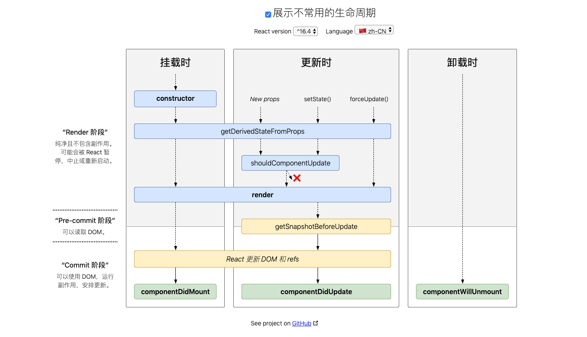

# 面试总结

## CSS

### BFC

> `BFC（Block Formatting Context）`块级格式化上下文

#### BFC的特点

1. BFC内部的子元素在垂直方向，边距会发生重叠。
2. BFC在页面中是独立的模块，外面的元素不会影响内部元素，反之亦然。
3. BFC区域不与float box重叠。
4. 计算BFC高度时，浮动的子元素也参与计算

#### 生成BFC

1. overflow: hidden/auto
2. float: left/right/inhert
3. position: absolute/fixed
4. display: inline-block/table-caption/table-cell/flex/inline-flex

### CSS实现水平垂直居中

```css
.father-layout {
  background: pink;
  width: 1000px;
  height: 200px;
  position: relative;
}
/*margin*/
/*子元素需定宽高*/
.child-layout {
  position: absolute;
  width: 100px;
  height: 50px;
  background: green;
  top: 50%;
  left: 50%;
  margin-top: -25px;
  margin-left: -50px;
}
/*transform*/
/*子元素无需定宽高，但是无法和动画结合使用*/
.child-layout2 {
  position: absolute;
  width: 100px;
  background: green;
  top: 50%;
  left: 50%;
  transform: translate(-50%, -50%);
}

/*flex*/
.father-layout {
  display: flex;
  align-items: center;
  justify-content: center;
}

```


## 前端框架

### Vue

####  生命周期

​	beforeCreate、created、beforeMount、mounted、beforeUpdate、updated、beforeDestroy、destoryed

​	


### React

#### 生命周期



### webpack/gulp

### SVG/canvas/d3


## 网络协议

### HTTP/HTTPS

### 网络分层

